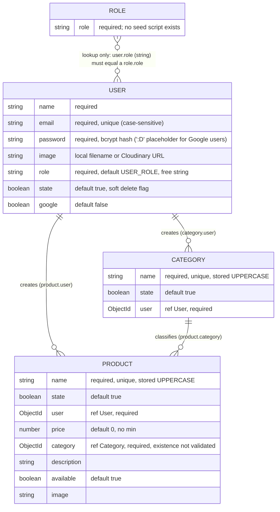

# Architecture

> Owner: Carlos Andrés Hinestroza Pérez (CarlosH / SH1FT3R) · Maintained by the Orchestrator
> Audit baseline: commit `2f18dce` (master) · Audited 2026-09-23 · Milestone 0

This document has three parts: the **as-is** inventory (what the code is today), the **to-be** target (what every milestone converges on), and the **ADR log** (why). Route-level detail lives in [API_PROGRESS.md](API_PROGRESS.md); every defect lives in [TECH_DEBT.md](TECH_DEBT.md).

---

## 1. As-is (audited)

> §1.1–§1.7 are the **M0 audit baseline** (commit `2f18dce`), kept as the historical record. Each milestone's resulting state follows in §1.8+; the current state of the 3.0 line is **§1.11**.

### 1.1 Stack and runtime

| Item | Value |
|---|---|
| Runtime | Node.js (no `engines` pin; local machine: v24.16.0) |
| Module system | CommonJS |
| Language | JavaScript, no type checking |
| Framework | Express 4 (`^4.18.2`, resolves 4.22.x) |
| Database | MongoDB via Mongoose 7 (`^7.5.0`) |
| Auth | JWT (`jsonwebtoken`), bcrypt, Google Identity (`google-auth-library`) |
| Media | Cloudinary SDK v1 + `express-fileupload` (local disk and Cloudinary both used) |
| Validation | `express-validator` 7, inline chains in route files |
| Tests | Jest 29 + supertest (non-functional, see TEST-01) |
| Package manager | pnpm (lockfile v6, **unreadable by the installed pnpm 12**, see OPS-01) |
| Size | ~1,550 LOC JavaScript across 34 files |

### 1.2 Folder structure

```
Backed-Rest-Server-Js/
├── app.js                  # entrypoint: dotenv + new Server().listen()
├── models/
│   ├── server.js           # Express app + DB connect + listen (misplaced: not a model)
│   ├── index.js            # barrel (re-exports Server as if it were a model)
│   ├── user.js  role.js  category.js  product.js
├── routes/                 # 6 routers, validation chains inline
│   ├── auth.js  usuarios.js  category.js  products.js  search.js  uploads.js
├── controllers/            # 6 controllers: HTTP + business rules + persistence + Cloudinary
│   ├── auth.js  usuarios.js  category.js  product.js  search.js  uploads.js
├── middlewares/            # validar-campos, validar-jwt, validar-roles, file-valid (+ barrel)
├── helpers/                # db-validators, generar-jwt, google-verify, upload-file (+ barrel)
├── database/config.js      # mongoose.connect(MONGO_CLOUD)
├── public/                 # static Google Sign-In demo page (index.html, js/auth.js, css, svg)
├── assets/notFound.jpg     # placeholder image served by GET /api/uploads
├── uploads/                # local disk image storage (gitignored contents)
├── e2e/                    # prueba.e2e.js (placeholder), user.e2e.js (broken)
├── jest-e2e.json  package.json  pnpm-lock.yaml  .example.env  .gitignore
```

Organisation is **layer-by-type**. There is **no service layer, no repository layer, no config module, no error module, no logger**.

### 1.3 Request pipeline (global middleware order, `models/server.js`)

```
cors() [all origins] → express.json() → express.static(public/) → fileUpload({useTempFiles, /tmp/}) [every route]
  → router → [route validators (express-validator) → validarCampos] → [validarJWT] → [esAdminRole|hasRole] → controller
  (no 404 handler, no error-handling middleware)
```

### 1.4 Layer inventory

| Layer | Present | Files | Notes |
|---|---|---|---|
| Routes | ✅ | 6 | Mounted at `/api/{auth,user,category,product,search,uploads}` plus a debug `GET /hello` |
| Controllers | ✅ | 6 (22 handlers) | Talk to Mongoose and Cloudinary directly; several async handlers have no error handling |
| Services | ❌ | — | Business rules live in controllers |
| Repositories | ❌ | — | Mongoose models used directly (see ADR-004: stays that way, deliberately) |
| Models | ✅ | 4 (+`Server`) | User, Role, Category, Product |
| Middlewares | ✅ | 4 | `validarCampos`, `validarJWT`, `esAdminRole` / `hasRole`, `fileValid` |
| Helpers | ✅ | 4 | DB existence validators, JWT signing, Google token verify, local file upload |
| Config | ⚠️ | 2 | `database/config.js`, `.example.env` (names only). `process.env` read ad hoc in 5 files |
| DTOs | ❌ | — | `req.body` spread straight into models |
| Error handling | ❌ | — | Per-handler try/catch where present; shapes differ per handler |
| Logging | ❌ | — | `console.log` only |
| Tests | ❌ | 2 | Both non-functional |
| API docs | ❌ | — | No README, no OpenAPI |

### 1.5 Data model and relationships



- No timestamps on any schema. No indexes beyond the implicit `unique` ones.
- Soft delete (`state: false`) on User, Category, Product, but unique `name` indexes ignore state, so a deleted name can never be reused.
- JSON shape is inconsistent: User maps `_id → uid` and hides `password`/`__v`; Product hides `state`/`__v`; Category only disables `versionKey`.

### 1.6 Environment variables

| Variable | Read in | Required | Notes |
|---|---|---|---|
| `PORT` | `models/server.js` | no | Fallback `1500`; code comments and `public/js/auth.js` assume `4321` |
| `MONGO_CLOUD` | `database/config.js` | yes | Missing value causes an unhandled rejection at boot |
| `SECRET_KEY` | `helpers/generar-jwt.js`, `middlewares/validar-jwt.js` | yes | Not validated; missing value only surfaces at first login |
| `GOOGLE_CLIENT_ID` | `helpers/google-verify.js` | yes (Google login) | Also **hardcoded** in `public/index.html` |
| `GOOGLE_SECRET_ID` | — | no | Declared in `.example.env`, never used |
| `CLOUDINARY_URL` | `controllers/uploads.js` (implicitly by the SDK) | yes (media) | `cloudinary.config(process.env.CLOUDINARY_URL)` is a no-op getter call |

### 1.7 Dependencies

Resolved versions come from a fresh resolution of `package.json` ranges; the committed lockfile could not be read (OPS-01).

| Package | Declared | Resolved | Latest (2026-09-23) | Role | Audit |
|---|---|---|---|---|---|
| express | ^4.18.2 | 4.22.3 | 5.2.1 | HTTP framework | — |
| mongoose | ^7.5.0 | 7.8.12 | 9.10.2 | ODM | — |
| jsonwebtoken | ^9.0.2 | 9.0.3 | 9.0.3 | JWT | — |
| bcrypt | ^5.1.1 | 5.1.1 | 6.0.0 | Password hashing | pulls `@mapbox/node-pre-gyp` → `tar` (**critical**, install-time) |
| cloudinary | ^1.41.0 | 1.41.3 | 2.11.0 | Media storage | **high**: argument injection (GHSA-g4mf-96x5-5m2c) |
| express-fileupload | ^1.4.1 | 1.5.2 | 1.5.2 | Multipart parsing | — (misconfigured, see SEC-08) |
| express-validator | ^7.0.1 | 7.3.2 | — | Validation | — |
| cors | ^2.8.5 | 2.8.6 | — | CORS | — (open to all origins) |
| dotenv | ^16.3.1 | 16.6.1 | — | Env loading | — |
| uuid | ^9.0.1 | 9.0.1 | — | Upload filenames | **moderate** (GHSA-w5hq-g745-h8pq); replaceable by `crypto.randomUUID()` |
| google-auth-library | ^9.0.0 (**devDependency**) | 9.15.1 | 11.1.0 | Google ID token verification | Required at runtime but declared dev-only (OPS-02) |
| jest / supertest / nodemon | dev | 29.7 / 6.3 / 3.1 | — | Tooling | — |

**Security-related packages present:** `bcrypt`, `jsonwebtoken`, `google-auth-library`, `cors`, `express-validator`.
**Absent:** `helmet`, rate limiting, request size/file limits, NoSQL filter sanitisation (`mongoose.set('sanitizeFilter')`), structured logging with redaction.


### 1.8 State after M1 (release 2.0.0, 2026-09-24)

M1 changed the as-is state above in place. There was no restructuring (ADR-001); the layout of §1.2 is unchanged.

**Request pipeline** (`models/server.js`):
```
[trust proxy ← TRUST_PROXY] → helmet(CSP for GIS + Fonts, COOP same-origin-allow-popups, CORP cross-origin) → cors() → express.json()
  → express.static(public/) → router
      /api/auth/{login,google}: authLimiter (10 / 15 min / IP, shared) → validators → controller
      /api/uploads writes:      validarJWT → esAdminRole | esAdminOrOwner → param validators → fileParser (1 file, 5 MB,
                                per-request temp folder removed on close) → fileValid → controller
      other routes:             [validarJWT] → [esAdminRole | esAdminOrOwner | hasRole] → validators → controller
  → 404 {msg:'Route not found'} → error middleware (C1 + A1: 409 / 400 / client 4xx / 500, no internals)
```
Boot: `app.js` awaits the DB connection, then `listen`, and exits 1 on failure. `new Server()` has no side effects.

**Environment:** adds the optional `TRUST_PROXY` (a non-negative integer hop count; an invalid value stops the boot). `GOOGLE_SECRET_ID` is still unused and is removed in M2.

**Dependencies:** pnpm 12.3.4 (lockfile v9), `engines.node >=24`, bcrypt 6, cloudinary 2, google-auth-library 11 (runtime), `uuid` removed; new: `helmet` 8 and `express-rate-limit` 8, plus `mongodb-memory-server` 11 and supertest 7 in dev. `pnpm audit --prod`: **0 advisories** (was 48).

**Security packages present:** `bcrypt`, `jsonwebtoken`, `google-auth-library`, `cors` (still any origin, allowlist in M2), `express-validator`, **`helmet`**, **`express-rate-limit`**. Still absent until M2: `sanitizeFilter`/`strictQuery`, structured logging with redaction.

**Tests:** 101 Jest + supertest + mongodb-memory-server e2e tests across 9 files (the security regression suite), with one known flake (TEST-02, T1.8).

**Still open from the audit:** ARC-02 and ARC-03 (M2), and every M2+ item in TECH_DEBT.md.


### 1.9 State after M2 (release 2.1.0, 2026-09-24)

**Stack:** Node 24 · **TypeScript 6** (strict, CommonJS output; `src/` → `dist/`, ADR-017/018) for the platform, with the legacy JS unchanged behind one seam · **Express 5.2.1** · **Mongoose 9.10.2** (driver 7.6, MongoDB ≥ 4.4) · zod 4 (config) · pino + pino-http · Vitest 5 + supertest + mongodb-memory-server · ESLint 10 (layer rules) + Prettier · GitHub Actions CI.

**Boot:** `src/server.ts`: `loadConfig()` (fail fast, exit 1 listing every bad variable) → `createLogger` → `connectDatabase` (`strictQuery`, `sanitizeFilter`) → `createApp` → `listen`, with graceful SIGTERM/SIGINT shutdown (10 s drain).

**Pipeline** (`src/app.ts`): `[trust proxy]` → pino-http (request id) → helmet → cors (allowlist) → `express.json` → static `public/` → `src/legacy.ts` (`/hello` + 6 legacy routers, each behind `legacyBodyCompat`) → `notFound` → `errorHandler` (`toAppError`, `{ msg }` bodies until 3.0.0).

**Layout:** `src/{server,app,legacy}.ts`, `src/config/`, `src/core/{errors,http,logger}`, `src/middlewares/`, `src/database/`; `tests/{setup,helpers,unit,integration/{platform,security}}`. Legacy `routes/ controllers/ middlewares/ helpers/ models/` are unchanged except the §4.8 ledger lines of the M2 design. `app.js`, `models/server.js`, `database/` and `e2e/` are gone.

**Environment:** see `.example.env`. Required: `MONGO_CLOUD`, `SECRET_KEY`, `GOOGLE_CLIENT_ID`, `CLOUDINARY_URL`. Optional: `NODE_ENV`, `PORT`, `LOG_LEVEL`, `CORS_ORIGINS`, `TRUST_PROXY`.

**Next (M3):** replace each legacy area with a TS feature module under `src/modules/` (ADR-016), removing its `src/legacy.ts` entry, with zod DTOs and the 3.0.0 envelope.

### 1.10 State after M3 (the 3.0 line on `next`, unreleased, 2026-09-24)

**Stack:** as in §1.9, and now **TypeScript only**. The legacy JavaScript, the strangler seam (`src/legacy.ts`) and `express-validator` are gone (ADR-016 completed). The only JS file is the demo page's `public/js/auth.js`.

**Layout** (the §2.2 target, as built):
```
src/
├── server.ts  app.ts                  # boot · composition root (wires every module; no I/O)
├── config/                            # zod env schema, fail fast
├── core/
│   ├── errors/                        # AppError family (+ RateLimitedError 429, PayloadTooLargeError 413), toAppError
│   ├── http/                          # envelope, pageEnvelope, errorEnvelope, paginationQuerySchema
│   ├── database/to-json.plugin.ts     # id; no _id/__v; hidden paths; uid alias (users, until 4.0.0)
│   ├── security/{roles,jwt}.ts        # ROLES enum (ADR-007), x-token TokenService
│   └── logger.ts
├── middlewares/                       # authenticate, authorize (requireAdmin/requireSelfOrAdmin/requireRole), validate,
│                                      # error-handler, not-found, request-logger
├── database/connection.ts
└── modules/
    ├── auth/        auth.{schemas,service,controller,routes}.ts · google.client.ts · index.ts   (no model)
    ├── users/       user.{model,schemas,service,controller,routes}.ts · index.ts
    ├── categories/  category.* (the reference module)
    ├── products/    product.*
    ├── search/      search.{service,controller,routes}.ts · index.ts                            (no model)
    └── media/       media.{schemas,service,controller,routes,upload}.ts · cloudinary.client.ts · index.ts
tests/{setup,helpers,unit,unit/modules,integration/{modules,platform,security}}
```

**Pipeline** (`src/app.ts`):
```
[trust proxy] → pino-http (request id) → helmet → cors (allowlist) → express.json → static public/
  → /api/{category,product,user,search,uploads,auth} → module router:
       [authenticate] → [guard, imported by the routes file] → validate(part, zod DTO) → controller → service → model
       media PUT: authenticate → authorizeCollection → validate(params) → fileParser (1 file, 5 MB, per-request temp folder
                  removed synchronously on close) → requireImage (magic bytes) → controller
       auth: one shared limiter (10 / 15 min / IP) → validate → controller
  → notFound → errorHandler (toAppError → { error: { code, message, details? } })
```

**Composition** (`createApp`): the token service and the `authenticate` user lookup are built once. Each module receives only what it needs, and a sibling's model arrives as a narrow interface (`CategoryLookup`, `SearchableModel`, `ImageRecordModel`, `SignInUserModel`). No module imports another (§2.3 rule 4, lint-enforced).

**Contract:** the 3.0.0 contract in [M3-modules §6](docs/design/M3-modules.md), recorded route by route in [API_PROGRESS.md](API_PROGRESS.md). This covers:
- the envelope;
- GET 200, POST 201, DELETE 204, validation 422 with `details`, missing or soft-deleted 404, duplicate 409, 429 `RATE_LIMITED` and 413 `PAYLOAD_TOO_LARGE`;
- `id` on every resource;
- the removed stub and debug routes.

**Tests:** 746 in 46 files:
- a contract test per module;
- service unit tests with fakes (ADR-023);
- the re-expressed M1 security suite and the M2 platform tests.

`src/**` coverage is about 99 %.

**Environment:** unchanged from §1.9.

**Next:**
- M4 (database) reconciles on the same model files: timestamps, indexes, the role enum, email normalisation, and dropping the 2.x `roles` collection.
- M5 hardens authentication; M6 replaces the interim guards with `authorize(policy)`.
- 3.0.0 is released from `next` after M6 (ADR-024, ADR-026).


### 1.11 State after M4 (the 3.0 line on `next`, unreleased, 2026-09-24)

**Data model** (design [M4-database](docs/design/M4-database.md), Part II and §15):
- **Every schema** has `{ versionKey: false, timestamps: true }`, trimmed and capped strings, and fixed validator messages (no `{VALUE}`, LOG-02).
- **users:** a lowercased email with a plain unique index `email_1`; `role` is `enum: ROLES`; `password` is `select: false` (authenticating reads ask for `+password`); a hidden `tokenVersion`.
- **categories and products:** an uppercased `name` with the partial, collated unique index `name_active_unique`, so only active names collide and a soft-deleted name is reusable; `price ≥ 0`.
- **The index catalogue** is §3.1 exactly: `email_1`, `state_1`, `user_1`, `category_1` and `name_active_unique`, and nothing speculative.

**Migrations and seed:**
- `src/database/migrate.ts` is an in-repo runner with a `migrations` ledger, `--dry-run` and retry-after-throw; there is no new dependency.
- `src/database/migrations/M001…M004`:
  - M001 normalizes emails;
  - M002 rebuilds the name indexes;
  - M003 backfills timestamps from `_id`;
  - M004 drops the 2.x `roles` collection.

  Each `up` aborts on its data check before writing.
- `src/database/seed.ts` is a create-only first-admin seed with an injected model.
- The CLI is `src/cli.ts`, a composition root like `server.ts` (ADR-031); it builds to `dist/cli.js` and runs as `pnpm migrate …` and `pnpm seed`.

**Boot:** `autoIndex` is off in production (the migrations build indexes) and on in dev/test. **Deploy order:** `pnpm migrate up` completes before the M4 code serves traffic (§7.1 step 0; an M9 boot guard, OPS-05).

**Tests:** 926. This adds DB-backed model, migration, index and seed tests, plus the normalization and secret-leak security suites.

**Next:** M5, authentication hardening: Bearer tokens, `tokenVersion` revocation, async bcrypt and a password policy (SEC-11, SEC-12, SEC-16, PERF-01).


### 1.12 State after M5 (the 3.0 line on `next`, unreleased, 2026-09-24)

**Authentication** (design [M5-auth](docs/design/M5-auth.md), §1 and §10):
- **Transport (ADR-032):** `authenticate` reads `Authorization: Bearer <token>`, where the scheme is case-insensitive (AM-M5-8).
  - It reads `x-token` only when there is no `Authorization` header, and marks that response `Deprecation: true`.
  - A malformed `Authorization` is 401 and never falls back.
- **Tokens (ADR-034):**
  - `src/core/security/jwt.ts` signs `{ uid, tv, iat, exp, iss, aud }` with HS256 pinned on sign and verify;
  - `iss`/`aud` are code constants;
  - `JWT_TTL` is converted to seconds once, in the config.
- **Revocation (ADR-033):**
  - `authenticate` refuses a token whose `tv` differs from the user's `tokenVersion`, with the same 401 as any invalid token.
  - `tokenVersion` goes up on `POST /api/auth/logout-all`, on `PUT /api/auth/password`, and on an administrator's reset of another user's password (AM-M5-10), each in one atomic write.
- **Passwords (ADR-035):** `src/core/security/password.ts` is the only module that imports `bcrypt`.
  - It hashes and compares asynchronously at `BCRYPT_COST`.
  - `passwordPolicy` accepts 8 characters to 72 UTF-8 bytes.
  - After a successful login, a hash of another cost is replaced by a compare-and-swap that is never awaited.
  - Every credential failure on login and on the password change costs one compare at the configured cost (F1).
  - Your own password changes only through `PUT /api/auth/password`, which requires the current one (AM-M5-10).
- **Google (ADR-036):**
  - `email_verified` is required;
  - a Google-only account has no `password` field;
  - a password account's address is refused rather than linked (AM-M5-1).
- **Rate limits (ADR-037):** `/login` has the shared per-IP budget and a per-account budget keyed on the normalized email. Both stores are in memory, per instance (SEC-06, M9).

**Data:** M005 backfills `tokenVersion`; M006 removes the Google `':D'` placeholder. The seed hashes at `BCRYPT_COST` (AM-M5-11).

**Environment:** `SECRET_KEY` must be at least 32 characters, or the boot fails. New variables: `JWT_TTL` (default `4h`) and `BCRYPT_COST` (10–14, default 10).

**Deploy order** (M5 design §10.1), on top of §1.11's M4 gate:
1. `SECRET_KEY` of at least 32 characters **before** the deploy.
2. Clients warned that every session ends at the deploy.
3. `pnpm migrate up` (M005/M006).
4. Rollback: `migrate down` before reverting the code.

**Tests:** 1109. This adds the password, token, revocation, limiter, Google and AM-M5-10 adversarial suites. `src/**` coverage is about 99 %.

**Next:** M6, authorization: `authorize(policy)` replaces the interim guards (ADR-028), with a permission matrix, ownership rules and the `VENTAS_ROLE` decision (SEC-13). Then 3.0.0 is released from `next` (ADR-024, ADR-026).


### 1.13 State after M6 (the 3.0 line on `next`, unreleased, 2026-09-25)

**Authorization** (design [M6-authz](docs/design/M6-authz.md), §1, §11 rulings AM-M6-1…9 and §12 as built):
- **One middleware (ADR-038):** `src/middlewares/authorize.ts` exports `authorize(policy)` with `Policy = { roles?, selfParam?, deferToService? }`. It never reads the database; `selfParam` compares ids case-insensitively (AM-M6-7). The interim guards of ADR-028 are gone.
- **Ownership (ADR-039, ADR-041 as narrowed by AM-M6-2):** only products have creator rights. `ProductsService.update`/`softDelete` take an `Actor` and put `user: actor.id` into the write filter for a caller outside `CATALOG_ROLES`; one `exists` read on a miss chooses 403 or 404. Categories are role-only, and neither service rewrites `user` on update.
- **Roles (ADR-040, AM-M6-5):** `CATALOG_ROLES = ['ADMIN_ROLE', 'VENTAS_ROLE']` in `src/core/security/roles.ts` is the single list for catalog writes and product images. `VENTAS_ROLE` has no user-management rights.
- **Self-lockout (ADR-042, AM-M6-3):** an administrator cannot change their own role or deactivate themself, and nobody can delete their own account; both are no-query checks in `UsersService`.
- **No revocation for role or state (ADR-043):** `authenticate` reads both from the database on every request, so a demotion applies to the next request on the same token.
- **Matrix (ADR-044 as amended by AM-M6-6):** `tests/helpers/permission-matrix.ts` is the single source; a drift check compares it with every registered route, and one HTTP request per cell checks the enforced status. API_PROGRESS carries the same matrix.

**Data:** none. `M001`–`M006` remain the complete migration set for 3.0.0.

**Deploy:** no new step on top of §1.11 and §1.12. Residual: two administrators demoting each other concurrently can leave none; recovery is `pnpm seed` with a new `SEED_ADMIN_EMAIL` (SEC-18).

**Tests:** 1263, with the permission matrix (one test per cell), its drift check and the adversarial authorization suite. `src/**` coverage is about 99 %.

**Next:** release **3.0.0** from `next` into `master` (ADR-024, ADR-026): the CHANGELOG `[3.0.0]` consolidation, the combined runbook (M6 design §10) and the tag. Then M7.

---

## 2. To-be (target)

### 2.1 Principles

Clean Architecture boundaries, feature-first, SOLID/DRY/KISS/YAGNI. **An abstraction is added only when it removes existing duplication or enables a test that is otherwise impossible.** Everything else is YAGNI.

### 2.2 Target layout

```
src/
├── server.ts               # boot: load config → connect DB → createApp() → listen → graceful shutdown
├── app.ts                  # createApp(deps): composition root, wires modules, no side effects
├── config/                 # env schema (zod), typed config object, fail-fast on boot
├── core/                   # cross-cutting, framework-agnostic where possible
│   ├── errors/             # AppError hierarchy (NotFound, Conflict, Forbidden, Unauthorized, Validation)
│   ├── http/               # response envelope, pagination query schema + helper
│   ├── logger.ts           # pino instance (redacts authorization, password)
│   └── security/           # password hashing, JWT sign/verify, roles enum
├── middlewares/            # authenticate, authorize(policy), validate(schema), error-handler, not-found
├── database/               # connection, migrations, seed
└── modules/
    ├── auth/               # auth.routes · auth.controller · auth.service · auth.schemas · google.client
    ├── users/              # users.routes · users.controller · users.service · users.schemas · user.model
    ├── categories/         # …same anatomy
    ├── products/
    ├── search/             # search.routes · search.controller · search.service (no model of its own)
    └── media/              # media.routes · media.controller · media.service · cloudinary.client
tests/
├── integration/            # supertest against createApp() + mongodb-memory-server
├── unit/                   # services with injected fakes
└── helpers/                # factories, auth helpers, db lifecycle
```

### 2.3 Layer rules (enforced in review; lint rule in M2)

```
routes ──► controller ──► service ──► model (Mongoose) / external client
   │            │             │
   └─ validate(schema)        └─ throws AppError; never touches req/res
```

1. **Routes** declare path, middleware (`authenticate`, the guards, `validate`), and the controller. Nothing else. Stateless guards are imported here; `authenticate` is injected (AM-M3-8).
2. **Controllers** translate HTTP ↔ service calls: read the validated DTO, call one service method, shape the response. No Mongoose, no business rules.
3. **Services** own business rules and persistence calls. They receive dependencies (models, clients, config) through a factory: `createUsersService({ User, passwordHasher, config })`. They throw `AppError`s and never import Express.
4. **Modules** never import another module. A sibling's model reaches a module through the composition root, as a narrow interface (M3, lint-enforced).
5. **Cross-cutting code** lives in `core/` and must not import from `modules/`.

---

## 3. ADR log

Status: **Accepted** = Orchestrator decision, binding on agents. **Proposed** = needs owner confirmation before its milestone starts.

| ID | Decision | Status | Rationale |
|---|---|---|---|
| ADR-001 | **Security hotfix (M1) ships before any refactor**, as minimal in-pattern changes to the current JS code | Accepted | The repo is public and a deployment URL is referenced in `public/js/auth.js`. Critical auth bypass and crash vectors can't wait for a restructure. |
| ADR-002 | **Migrate to TypeScript (strict)**, incrementally: `tsc` for typecheck/build, `tsx` for dev, `allowJs` during the transition (see ADR-016) | Accepted (owner delegated the decision 2026-09-23); `allowJs` removed with the last legacy JS (M3/T3.8b, a8310e8) | The mandate asks for type-safe interfaces. At ~1.5k LOC the migration is cheapest now; zod-inferred DTOs (ADR-006) and compile-checked contracts between parallel agents pay for it. |
| ADR-003 | **Upgrade to Express 5** in M2 | Accepted | Native promise-rejection forwarding removes a whole class of crash bugs (REL-01) with no `asyncHandler` wrapper. Deferred from M1 to keep the hotfix minimal. |
| ADR-004 | **No repository layer.** Services use Mongoose models directly, injected via factories | Accepted | Mongoose already is the data mapper; wrapping it adds a layer with no second implementation. Testability comes from `mongodb-memory-server` + DI. Revisit only if a second datastore appears. |
| ADR-005 | **DI by factory functions + one composition root** (`createApp`), no DI container library | Accepted | Explicit, zero-dependency, trivially testable. |
| ADR-006 | **zod schemas are the DTOs** (validation + inferred types + OpenAPI source); `express-validator` is removed in M3 | Accepted | One source of truth for shape, type, and docs (DRY). |
| ADR-007 | **Roles are a code-level enum**; the `Role` collection lookup is removed | Accepted | Roles are static. The DB lookup costs a query per validation and blocks onboarding on an unseeded DB (DB-01). |
| ADR-008 | **Cloudinary is the only media store**; local-disk upload/serve is removed in M3 | Accepted | Two strategies coexist and conflict (FUNC-01). Local disk breaks stateless containers (M9). |
| ADR-009 | **Single error model:** `AppError` hierarchy + one error middleware + one response envelope | Accepted | Replaces five different error shapes (REL-02, HTTP-01). |
| ADR-010 | **Auth transport `Authorization: Bearer`**; `x-token` accepted with a deprecation header for one major. Revocation via a `tokenVersion` claim. **No refresh tokens** (YAGNI) until a client needs long sessions | Accepted | Standard transport. Revocation without a new collection, since `validarJWT` already loads the user per request. |
| ADR-011 | **Logging:** pino + pino-http, request id, redaction of `authorization`/`x-token`/`password` | Accepted | Structured, fast, stdout-friendly for containers. |
| ADR-012 | **Package manager: pnpm**, pinned through `packageManager` + corepack; lockfile regenerated | Accepted | Keeps the existing choice and makes installs reproducible (OPS-01). |
| ADR-013 | **Tests are a gate in every milestone**, not a phase. Stack: Jest in M1 (existing), Vitest + supertest + mongodb-memory-server from M2 | Accepted | The refactor needs a safety net before it starts. |
| ADR-014 | **Node 24 LTS** is the runtime baseline (`engines`, `.nvmrc`, Docker base image) | Accepted | Current LTS, already installed locally. |
| ADR-015 | **API versioning by SemVer, not by URL.** The first release carrying breaking changes is `2.0.0`; no `/api/v1` prefix | Accepted | API consumers are unknown. A URL prefix would itself break every current client; CHANGELOG plus the API_PROGRESS ledger carry the contract. |
| ADR-016 | **Strangler migration.** M2 builds the TS platform (`src/config`, `src/core`, `src/app.ts`, `src/server.ts`) and mounts the legacy JS routers unchanged; M3 replaces each legacy area with a TS feature module, and legacy files are deleted when their module lands | Accepted; **completed in M3** (T3.8b, a8310e8: the seam and every legacy JS file deleted) | Every file is converted once, never twice. The M1 regression suite stays green at every step, giving each commit a safety net. |
| ADR-017 | **CommonJS output; `src/` → `dist/` build; legacy JS stays outside the build.** `src/legacy.ts` is the only TS→JS seam; legacy never requires `src/`. In M3, legacy reads TS-owned models from the Mongoose registry | Accepted 2026-09-23 (D2 review; details in [M2-foundation](docs/design/M2-foundation.md) §1.1); `src/legacy.ts` deleted in M3 | Legacy `__dirname` paths keep working; one instance of every CJS package is shared by app, legacy and tests. ESM output is a separate decision after M3. |
| ADR-018 | **TypeScript 6.0.3**, not 7.x, until typescript-eslint supports 7; the tsconfig stays 7-clean | Accepted 2026-09-23 (D2 review; details in [M2-foundation](docs/design/M2-foundation.md) §1.1) | `typescript-eslint@8.70.1` caps TypeScript at `<6.1.0`. Revisit in M10 (Renovate). |
| ADR-019 | **Config:** one zod env schema, fail-fast at boot (exit 1, every bad variable listed); env names unchanged; empty = unset; `dotenv` → `node --env-file-if-exists`. Until M3, legacy JS reads only `SECRET_KEY`, `GOOGLE_CLIENT_ID`, `CLOUDINARY_URL` from `process.env` (lint allowlist). `TRUST_PROXY` (C9) is part of the schema | Accepted 2026-09-23 (D2 review; details in [M2-foundation](docs/design/M2-foundation.md) §1.1) | CFG-01 fixed for the platform in M2 and fully in M3. `GOOGLE_CLIENT_ID` is required, because an unset audience would accept any Google client's tokens. |
| ADR-020 | **Logging wiring:** pino-http is the first middleware, `x-request-id` in/out, one line per request with the error cause. Legacy logs only via `req.log`; `console.*` is a lint error | Accepted 2026-09-23 (D2 review; details in [M2-foundation](docs/design/M2-foundation.md) §1.1) | LOG-01 fixed in M2 with no AsyncLocalStorage and no new legacy imports. |
| ADR-021 | **Error bodies stay `{ msg }` in M2** (M1 C1/C2 byte-identical). `AppError`, `toAppError` and the envelope helpers ship in M2; the handler switches to `{ error: { code, message, details? } }` in M3 as part of **3.0.0** (ADR-024) | Accepted 2026-09-23 (D2 review; details in [M2-foundation](docs/design/M2-foundation.md) §1.1) | No two error shapes in one release. REL-02 fixed in M2; HTTP-01 in M3. |
| ADR-022 | **CORS allowlist via `CORS_ORIGINS`**; unset or `*` keeps any-origin, with a `warn` at production boot. Kept as written (D2 Q3): auth is a header token, never a cookie, and consumers are unknown | Accepted 2026-09-23 (D2 review; details in [M2-foundation](docs/design/M2-foundation.md) §1.1) | SEC-10 allowlist available; the M9 production checklist sets it. |
| ADR-023 | **No `vi.mock`** (it can't reach `require()` in legacy CJS): tests spy on the shared instance the code uses (M2: via `tests/helpers/legacy.ts`; since M3: the injected clients, e.g. `tests/helpers/{auth,uploads}.ts`), or inject a fake through the factory. One process and one database per test file on a shared `mongod` | Accepted 2026-09-23 (D2 review; details in [M2-foundation](docs/design/M2-foundation.md) §1.1) | The M1 suite ports mechanically; files run in parallel safely. |
| ADR-024 | **Release mapping (SemVer, ADR-015).** M1 ships as **2.0.0** (breaking security fixes, releasable alone). M2 ships as **2.1.0** (operational and additive; operator objects in filters now get 400 as a security fix). The M3–M6 contract changes (envelope, status codes, `id`, Bearer auth, RBAC) are batched into **3.0.0**. Deprecated aliases (`uid`, `x-token`) are removed in **4.0.0**. Releases are git tags on `master` | Accepted 2026-09-23 (Orchestrator) | Clients migrate once per major. Erratum: D2's "2.0.0" for the envelope switch reads 3.0.0, and D4's "`uid` until 3.0.0" reads 4.0.0. Version numbers come from this mapping, not from commit markers: a `!` on an M2 dependency-upgrade commit (`build(deps)!:` for Express 5 and Mongoose 9) marks an internal breaking change for developers, not an API break. Release tooling (M10) must start from the `v2.1.0` tag. |
| ADR-025 | **Supply-chain age gate.** Keep pnpm 12's default `minimumReleaseAge` (24 h) and **never** add `minimumReleaseAgeExclude`. A dependency task pins only versions published at least 24 h earlier, or waits for the gate to clear, and proves it with a cold frozen install (empty store, state and cache) | Accepted 2026-09-24 (Orchestrator, from the T2.1 finding) | A fresh release is the classic window for a compromised package. The local verification cache hides violations, so the cold install is the only real proof. |
| ADR-026 | **Release lines.** `master` carries the released 2.x line (2.1.0), and a hotfix is cut from it as 2.1.x. The 3.0 line accumulates on a long-lived **`next`** branch. Each milestone M3–M6 integrates on its own `mN/*` branch, cut from `next`, and merges back into `next` when accepted. `next` merges into `master` as **3.0.0** after M6 (ADR-024). Security fixes land on `master` first and are merged forward into `next` | Accepted 2026-09-24 (Orchestrator) | Clients see one breaking release. `master` stays deployable and patchable throughout the M3–M6 rewrite. |
| ADR-027 | **Registry seam for migrated models.** The TS model is the sole `mongoose.model` registrant, behind an idempotent guard. The legacy `models/<x>.js` becomes a registry re-export. Cross-module models are resolved lazily or from the owning module | Accepted 2026-09-24 (D3 review; details in [M3-modules](docs/design/M3-modules.md) §1.1); implemented in M3 (T3.2–T3.7); the `models/*.js` re-exports left with the legacy JS (T3.8b), the TS models stay the sole registrants | Removes `OverwriteModelError`/`MissingSchemaError` during the strangler (both reproduced). |
| ADR-028 | **Interim `authenticate` (x-token) and `requireAdmin` / `requireSelfOrAdmin` / `requireRole` guards** with today's semantics | Accepted 2026-09-24 (D3 review; details in [M3-modules](docs/design/M3-modules.md) §1.1); implemented in M3 (T3.1 255cd1e); the stateless guards are imported by each routes file (AM-M3-8) | M5 swaps the transport, M6 replaces the guards with `authorize(policy)`, and the route wiring doesn't change again. **Superseded in M6 by ADR-038.** |
| ADR-029 | **zod DTOs and one `validate(part, schema)` middleware → 422 with `details`.** `express-validator` and `db-validators` are removed; existence checks become find-active-or-404 in services | Accepted 2026-09-24 (D3 review; details in [M3-modules](docs/design/M3-modules.md) §1.1); implemented in M3 (T3.1 255cd1e + every module); `express-validator` removed (T3.8b) | Fixes VAL-01, VAL-02 and F3. Express 5 getter-only `query`/`params` are handled with `defineProperty`. |
| ADR-030 | **Media is Cloudinary only.** `POST /api/uploads` is removed. `GET` 302-redirects **only to this app's own Cloudinary cloud** (AM-M3-1), otherwise 404. Magic-byte MIME sniffing; parser errors → 400; oversize → 413 JSON; C10/C11 kept | Accepted 2026-09-24 (D3 review; details in [M3-modules](docs/design/M3-modules.md) §1.1); implemented in M3 (T3.7 8f74d0c, T3.7R c1094a0) | Fixes FUNC-01, HTTP-02, F4 and SEC-08 (MIME). The allowlist prevents an open redirect from legacy `image` values. |
| ADR-031 | **Schema-owned data changes run through an in-repo migration runner, and the CLI is a second composition root.** Migrations live in `src/database/migrations/`, are recorded in a `migrations` ledger, and each `up` aborts on a data check before writing. `autoIndex` is off in production, so only the migrations build indexes. `src/cli.ts` (like `src/server.ts`) wires models into the seed; `src/database/**` imports no module. | Accepted 2026-09-24 (M4: D4R §9–§15, AM-M4-7; implemented T4.1/T4.4) | No new dependency (ADR-025); a production index build only happens after its data check; the layer rules stay intact. |
| ADR-032 | **Auth transport: `Authorization: Bearer` first; `x-token` only when there is no `Authorization` header,** with `Deprecation: true` (RFC 9745) on those responses. A malformed `Authorization` is 401 with no fallback. The scheme is case-insensitive (AM-M5-8) | Accepted 2026-09-24 (D5 review, AM-M5-1…11; details in [M5-auth](docs/design/M5-auth.md) §1 and §10); implemented in M5 (T5.1 51f7ce3, T5.1R 760bf5d) | Implements ADR-010's transport. The precedence is deterministic and testable; `x-token` goes in 4.0.0 (a `Sunset` date is added once 4.0.0 is scheduled). |
| ADR-033 | **Revocation by one per-user `tokenVersion`, signed as the `tv` claim.** It goes up on logout-all, on a password change and on an administrator's password reset of another user; a mismatch is the same 401 as any invalid token | Accepted 2026-09-24 (D5 review, AM-M5-1…11; details in [M5-auth](docs/design/M5-auth.md) §1 and §10); implemented in M5 (T5.1 51f7ce3, T5.2 40f3176, T5.2R f072de4) | No session store: `authenticate` already loads the user. Every device is signed out together (no per-device logout, YAGNI). |
| ADR-034 | **JWT claims `{ uid, tv, iat, exp, iss, aud }`, HS256 pinned on sign and verify;** `iss`/`aud` are code constants; `JWT_TTL` is configurable (default 4h); `SECRET_KEY` ≥ 32 characters at boot | Accepted 2026-09-24 (D5 review, AM-M5-1…11; details in [M5-auth](docs/design/M5-auth.md) §1 and §10); implemented in M5 (T5.1 a4ec277, 51f7ce3) | Closes the "any HMAC variant" laxity and gives tokens an audience. **Breaking:** every earlier token is refused on deploy, and a short secret stops the boot. |
| ADR-035 | **Async bcrypt at `BCRYPT_COST` (10–14, default 10) everywhere, the seed included (AM-M5-11); a 72-byte password policy; rehash-on-login** as a never-awaited compare-and-swap after a successful compare | Accepted 2026-09-24 (D5 review, AM-M5-1…11; details in [M5-auth](docs/design/M5-auth.md) §1 and §10); implemented in M5 (T5.2 f853ba9, T5.2R b190101) | Fixes PERF-01 and SEC-16 for new writes, and narrows the SEC-07 timing residual to accounts not yet rehashed. |
| ADR-036 | **Google sign-in requires `email_verified`; a Google-only account has no password; a password account's address is refused, not linked** (AM-M5-1). Every failure is the generic 401 | Accepted 2026-09-24 (D5 review, AM-M5-1…11; details in [M5-auth](docs/design/M5-auth.md) §1 and §10); implemented in M5 (T5.2 d20d641, T5.3 M006 27cef33) | Fixes SEC-12. It is the reversible safe default for account linking; an explicit, authenticated linking flow is future work if a client needs it. |
| ADR-037 | **Two limiters on `/login`:** the shared per-IP budget (C5/C9, unchanged) and a per-account budget on the normalized email (10 / 15 min), both in memory. There is no account budget for a body without a string email, and the account limiter sends no `RateLimit-*` headers | Accepted 2026-09-24 (D5 review, AM-M5-1…11; details in [M5-auth](docs/design/M5-auth.md) §1 and §10); implemented in M5 (T5.2 f823254) | Caps IP-rotating attacks on one account. No new dependency; the store stays per instance (M9). Targeted lockout is accepted (SEC-17). |
| ADR-038 | **One `authorize(policy)` middleware** replaces `requireAdmin`/`requireSelfOrAdmin`/`requireRole`. `Policy = { roles?, selfParam?, deferToService? }`; it never reads the database, and `selfParam` is case-insensitive (AM-M6-7) | Accepted 2026-09-25 (D6 review, AM-M6-1…9; details in [M6-authz](docs/design/M6-authz.md) §1, §11 and §12); implemented in M6 (T6.1 7d5ef64) | Closes SEC-13's "three guards, contradictory comments". No new dependency (no CASL/casbin, ADR-025). |
| ADR-039 | **Ownership that needs the stored resource is enforced inside the service's write filter**, atomically; one `exists` read on a miss chooses 403 (exists, not yours) or 404 (missing or soft-deleted) | Accepted 2026-09-25 (D6 review); implemented in M6 (T6.1 2474e35) | No check-then-write window, and one existence filter per service. A non-creator's malformed id is 422 before the ownership 403. |
| ADR-040 | **`VENTAS_ROLE` is the catalog manager:** it writes any product or category and replaces product images; it has no user-management rights. `CATALOG_ROLES` is the one list (AM-M6-5) | Accepted 2026-09-25 (D6 review, AM-M6-1, reversible); implemented in M6 (T6.1 2474e35) | Defines the role SEC-13 found undefined, with no migration (no `M007`). **Breaking:** it can no longer delete users. |
| ADR-041 | **A product's creator may update and delete their own active product; categories have no creator rights** (AM-M6-2), and image replacement is not extended to creators. No update rewrites the creator | Accepted 2026-09-25 (D6 review, AM-M6-2, reversible); implemented in M6 (T6.1 2474e35) | Closes the "can create but never fix" gap for products without letting one user rename or delete a category other users' products reference. |
| ADR-042 | **Self-lockout guard:** an administrator cannot change their own role or deactivate themself (resending the current values is accepted, AM-M6-3), and nobody can delete their own account. No administrator count, no query | Accepted 2026-09-25 (D6 review, AM-M6-3, reversible); implemented in M6 (T6.1 3ff7788) | Removes the unrecoverable self-lockout. Residual: concurrent mutual demotion (SEC-18), recovered with the seed. |
| ADR-043 | **A role or state change does not bump `tokenVersion`** | Accepted 2026-09-25 (D6 review) | `authenticate` reads role and state from the database on every request, so there is no window to close; a bump would only force a re-login. |
| ADR-044 | **The permission matrix is test data, not production code:** `tests/helpers/permission-matrix.ts` is the single source; a drift check against every registered route plus one HTTP request per cell (amended by AM-M6-6: no `ROUTE_POLICIES` exports) | Accepted 2026-09-25 (D6 review, AM-M6-6); implemented in M6 (T6.2A a32485a, T6.2B 64fb937, T6.2C 0d52042) | A route added without a matrix row fails `pnpm test`. Mount prefixes come from the fixture (Express 5 exposes none; TEST-05). |
