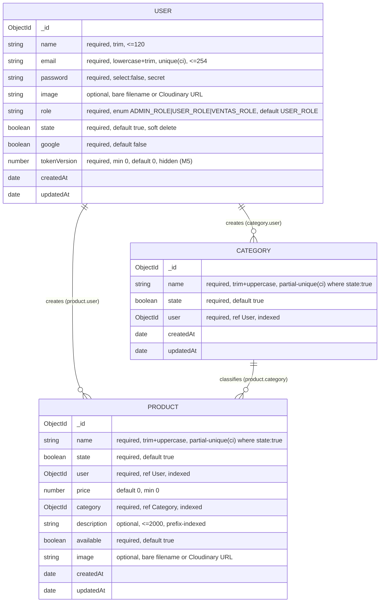

# M4 — Database Design

> Milestone **M4 (Database Improvements)** · Design only — no code in this document is executed by the M4 design task.
> Owner: CarlosH / SH1FT3R · Prepared by the DATABASE AGENT · 2026-09-23
> Governing ADRs: **ADR-002** (TypeScript strict), **ADR-004** (no repository layer), **ADR-005** (DI factories + one composition root), **ADR-006** (zod DTOs), **ADR-007** (roles are a code enum; `Role` collection removed), **ADR-008** (Cloudinary-only media), **ADR-013/016** (tests are a gate; strangler migration), **ADR-014** (Node 24), **ADR-015** (SemVer versioning, `uid` alias until 3.0.0).
> Debt closed or advanced: **DB-01, DB-02, PERF-02, PERF-03** (M4) · **SEC-14** is an M2 prerequisite restated here · **SEC-04** image shape and **C1** duplicate-key → 409 are respected.

---

## 0. Scope, assumptions, non-goals

**Assumes M3 has landed.** By M4 the feature modules exist at `src/modules/<feature>/` with the ARCHITECTURE §2.2 anatomy, controllers are thin, services own persistence, zod schemas are the DTOs, and the app is Express 5 + TypeScript strict + Mongoose 9. Nothing in this design re-derives those decisions; it only changes the schemas, the indexes, serialization, migrations and seed that live *under* those modules.

**In scope (M4 deliverables):** timestamps on every schema; normalized + uniquely indexed email; role enum with the `Role` collection removed; `price ≥ 0`; partial unique indexes on `name` where `state: true`; indexes on `state`/`category`/`user`; an indexable search strategy; a shared `toJSON` plugin; a migration runner with up/down and a reversible-where-possible migration set; an idempotent first-admin seed; a `tokenVersion` field for M5; the operational checklist and test plan that prove all of it.

**Out of scope:** bearer-token transport, `tokenVersion` enforcement, refresh tokens and password policy (M5); the `authorize(policy)` middleware and the ownership matrix (M6); Docker and graceful shutdown (M9); the zod `image` DTO itself (M3 — M4 only adds the schema-level guard); `sanitizeFilter`/`strictQuery` (M2, restated as an assumption).

**Principles applied (ARCHITECTURE §2.1):** every index added here must be traced to a real query in the codebase (no speculative indexes); the migration runner is chosen by YAGNI, not by familiarity; the design adds **no new dependency** beyond the existing Mongoose.

---

## 1. Where the code lives after M3

| Concern | Path |
|---|---|
| Models | `src/modules/users/user.model.ts` · `src/modules/categories/category.model.ts` · `src/modules/products/product.model.ts` |
| Serialization plugin | `src/core/database/to-json.plugin.ts` |
| Roles enum | `src/core/security/roles.ts` |
| Connection | `src/database/connection.ts` (from M2) |
| Migration runner + migrations | `src/database/migrate.ts` · `src/database/migrations/M001-*.ts` … |
| Seed | `src/database/seed.ts` |
| CLI | `src/database/cli.ts` (`migrate up|down|status`, `seed`) |

`Role` is removed entirely (ADR-007): no `role.model.ts`, no `roles` module, no `esRoleValido` helper. Any remaining reference to the `roles` collection is a bug by the time M4 starts.

---

## 2. Schema design

### 2.0 Shared conventions

| Convention | Decision | Rationale |
|---|---|---|
| `timestamps` | `{ timestamps: true }` on **all three** schemas → `createdAt`, `updatedAt` (`Date`). | DB-02; enables "newest first" lists and the createdAt backfill. |
| `_id` | Keep the default `ObjectId`. Never expose it as `_id`. | M0 contract already maps `_id → uid` for users; §4 generalizes it to `id`. |
| `versionKey` | Leave Mongoose's `__v` in the database, remove it in `toJSON` (the plugin sets `versionKey: false`). | Dropping it from the DB (`versionKey: false`) is an unrelated change; the plugin is the single place that shapes the API. |
| Field-level `unique`/`index` | **None.** All indexes are declared with explicit `schema.index(...)` and explicit names. | Avoids automatically-named duplicate indexes and keeps the catalogue in §3 as the single source of truth. |
| Soft delete | `state: Boolean, required, default true` stays on all three schemas. | Soft delete is an M3 service rule; M4 only makes the name unique index *respect* it. |
| Secrets | `password` is `select: false` **and** hidden by the plugin; `tokenVersion` is hidden by the plugin. | Defense in depth; see §4. |

### 2.1 Users — `src/modules/users/user.model.ts`

| Field | Type | Required | Validation | Default | Index | Notes |
|---|---|---|---|---|---|---|
| `name` | `String` | yes | `trim: true`, `maxlength: 120` | — | `name_prefix_ci` (search) | Trims accidental whitespace; length cap guards junk. |
| `email` | `String` | yes | `trim: true`, **`lowercase: true`**, `maxlength: 254`, `match: /^[^\s@]+@[^\s@]+\.[^\s@]+$/` | — | **`email_1` unique, collation `en@strength 2`** | Normalization (DB-02) makes uniqueness case-insensitive; the collation also lets the admin user-search use the index. Legacy `unique: true` field option removed. |
| `password` | `String` | yes | `select: false` | — | — | bcrypt hash. Google users will get a real secret in M5 (SEC-12); for now required. **Any service that authenticates must `.select('+password')`.** |
| `image` | `String` | no | `trim: true`, `validate`: bare filename **or** a `https://res.cloudinary.com/...` URL | — | — | Preserves the M1 SEC-04 policy; the DB now rejects traversal-looking values that a rogue client could store. |
| `role` | `String` | yes | `enum: ['ADMIN_ROLE','USER_ROLE','VENTAS_ROLE']` | `'USER_ROLE'` | — | ADR-007, preserves existing stored strings (incl. `VENTAS_ROLE`, referenced today but undefined — SEC-13). |
| `state` | `Boolean` | yes | — | `true` | `state_1` | Soft-delete flag; serves `{ state: true }` list/count. |
| `google` | `Boolean` | yes | — | `false` | — | — |
| `tokenVersion` | `Number` | yes | `min: 0` | `0` | — | M5 revocation counter (ADR-010). Hidden from JSON (§4). |
| `createdAt` / `updatedAt` | `Date` | auto | — | now | — | `timestamps: true`. |

```ts
// src/modules/users/user.model.ts
import { Schema, model, type HydratedDocument, type InferSchemaType } from 'mongoose';
import { ROLES, DEFAULT_ROLE } from '../../core/security/roles';
import { toJsonPlugin } from '../../core/database/to-json.plugin';

const IMAGE_PATTERN = /^([A-Za-z0-9._-]+|https:\/\/res\.cloudinary\.com\/.+)$/;

export const userSchema = new Schema(
  {
    name:         { type: String, required: true, trim: true, maxlength: 120 },
    email:        { type: String, required: true, trim: true, lowercase: true, maxlength: 254,
                    match: /^[^\s@]+@[^\s@]+\.[^\s@]+$/ },
    password:     { type: String, required: true, select: false },
    image:        { type: String, trim: true,
                    validate: { validator: (v?: string) => v == null || IMAGE_PATTERN.test(v),
                                message: 'image must be a bare filename or a Cloudinary URL' } },
    role:         { type: String, required: true, enum: ROLES, default: DEFAULT_ROLE },
    state:        { type: Boolean, required: true, default: true },
    google:       { type: Boolean, required: true, default: false },
    tokenVersion: { type: Number, required: true, default: 0, min: 0 },
  },
  { timestamps: true },
);

userSchema.index({ email: 1 }, { name: 'email_1', unique: true, collation: { locale: 'en', strength: 2 } });
userSchema.index({ name: 1 },  { name: 'name_prefix_ci',  collation: { locale: 'en', strength: 2 } });
userSchema.index({ state: 1 }, { name: 'state_1' });

toJsonPlugin(userSchema, { hidden: ['password', 'tokenVersion'], uidAlias: true });

export type User = InferSchemaType<typeof userSchema>;
export type UserDocument = HydratedDocument<User>;
export const UserModel = model('User', userSchema);
```

### 2.2 Categories — `src/modules/categories/category.model.ts`

| Field | Type | Required | Validation | Default | Index | Notes |
|---|---|---|---|---|---|---|
| `name` | `String` | yes | `trim: true`, `uppercase: true`, `maxlength: 120` | — | **`name_active_unique`** (partial unique, collated) + search | Existing controller uppercases; schema makes it authoritative. |
| `state` | `Boolean` | yes | — | `true` | `state_1` | — |
| `user` | `ObjectId` ref `User` | yes | — | — | `user_1` | Creator; M6 ownership. |
| `createdAt` / `updatedAt` | `Date` | auto | — | now | — | `timestamps: true`. |

```ts
// src/modules/categories/category.model.ts
import { Schema, model, type InferSchemaType } from 'mongoose';
import { toJsonPlugin } from '../../core/database/to-json.plugin';

export const categorySchema = new Schema(
  {
    name:  { type: String, required: true, trim: true, uppercase: true, maxlength: 120 },
    state: { type: Boolean, required: true, default: true },
    user:  { type: Schema.Types.ObjectId, ref: 'User', required: true },
  },
  { timestamps: true },
);

categorySchema.index(
  { name: 1 },
  { name: 'name_active_unique', unique: true,
    collation: { locale: 'en', strength: 2 },
    partialFilterExpression: { state: true } },
);
categorySchema.index({ state: 1 }, { name: 'state_1' });
categorySchema.index({ user: 1 },  { name: 'user_1' });

toJsonPlugin(categorySchema);

export type Category = InferSchemaType<typeof categorySchema>;
export const CategoryModel = model('Category', categorySchema);
```

### 2.3 Products — `src/modules/products/product.model.ts`

| Field | Type | Required | Validation | Default | Index | Notes |
|---|---|---|---|---|---|---|
| `name` | `String` | yes | `trim: true`, `uppercase: true`, `maxlength: 120` | — | **`name_active_unique`** + search | — |
| `state` | `Boolean` | yes | — | `true` | `state_1` | — |
| `user` | `ObjectId` ref `User` | yes | — | — | `user_1` | Creator. |
| `price` | `Number` | no | **`min: 0`** | `0` | — | DB-02 (`min` added). No upper bound (out of scope). |
| `category` | `ObjectId` ref `Category` | yes | — | — | `category_1` | Adds the missing index (PERF-03). M3 validates existence; M4 indexes the FK. |
| `description` | `String` | no | `trim: true`, `maxlength: 2000` | — | `description_prefix_ci` (search) | Search field (C8). |
| `available` | `Boolean` | yes | — | `true` | — | — |
| `image` | `String` | no | bare filename or Cloudinary URL (same validator as User) | — | — | M3 stores a Cloudinary `secure_url`. |
| `createdAt` / `updatedAt` | `Date` | auto | — | now | — | `timestamps: true`. |

```ts
// src/modules/products/product.model.ts
import { Schema, model, type InferSchemaType } from 'mongoose';
import { toJsonPlugin } from '../../core/database/to-json.plugin';

const IMAGE_PATTERN = /^([A-Za-z0-9._-]+|https:\/\/res\.cloudinary\.com\/.+)$/;

export const productSchema = new Schema(
  {
    name:        { type: String, required: true, trim: true, uppercase: true, maxlength: 120 },
    state:       { type: Boolean, required: true, default: true },
    user:        { type: Schema.Types.ObjectId, ref: 'User', required: true },
    price:       { type: Number, default: 0, min: 0 },
    category:    { type: Schema.Types.ObjectId, ref: 'Category', required: true },
    description: { type: String, trim: true, maxlength: 2000 },
    available:   { type: Boolean, required: true, default: true },
    image:       { type: String, trim: true,
                   validate: { validator: (v?: string) => v == null || IMAGE_PATTERN.test(v),
                               message: 'image must be a bare filename or a Cloudinary URL' } },
  },
  { timestamps: true },
);

productSchema.index(
  { name: 1 },
  { name: 'name_active_unique', unique: true,
    collation: { locale: 'en', strength: 2 },
    partialFilterExpression: { state: true } },
);
productSchema.index(
  { description: 1 },
  { name: 'description_prefix_ci', collation: { locale: 'en', strength: 2 },
    partialFilterExpression: { state: true } },
);
productSchema.index({ state: 1 },    { name: 'state_1' });
productSchema.index({ category: 1 }, { name: 'category_1' });
productSchema.index({ user: 1 },     { name: 'user_1' });

toJsonPlugin(productSchema);

export type Product = InferSchemaType<typeof productSchema>;
export const ProductModel = model('Product', productSchema);
```

### 2.4 Role — removed (ADR-007)

The `Role` schema, the `roles` collection and the `role` existence validator are deleted. Roles become:

```ts
// src/core/security/roles.ts
export const ROLES = ['ADMIN_ROLE', 'USER_ROLE', 'VENTAS_ROLE'] as const;
export type Role = (typeof ROLES)[number];
export const DEFAULT_ROLE: Role = 'USER_ROLE';
export const isRole = (value: unknown): value is Role =>
  typeof value === 'string' && (ROLES as readonly string[]).includes(value);
```

Consequences: sign-up no longer needs a seeded collection (closes the onboarding half of **DB-01**); the role validator is `z.enum(ROLES)` in the DTO (M3) and `enum: ROLES` at the schema (M4), so a write can never store a role outside the list. The migration that drops the collection is M004 (§5.3), gated on a data check.

### 2.5 Relationships (updated ER diagram)



---

## 3. Indexes

### 3.1 Index catalogue (exact definitions + the query each serves)

Collections and index names are exact; every index maps to a query that exists after M3.

**`users`**

| Index | Definition | Query served |
|---|---|---|
| `email_1` | `{ email: 1 }`, `unique: true`, `collation: { locale: 'en', strength: 2 }` | Login/Google lookup `UserModel.findOne({ email })` and sign-up uniqueness; also the admin user-search email prefix branch. Case-insensitive uniqueness is the belt to the `lowercase: true` braces. |
| `name_prefix_ci` | `{ name: 1 }`, `collation: { locale: 'en', strength: 2 }` | Admin user search: `{ state: true, $or: [{ name: /^x/ }, { email: /^x/ }] }`. |
| `state_1` | `{ state: 1 }` | `GET /api/user` list/count `{ state: true }` (PERF-03). |

**`categories`**

| Index | Definition | Query served |
|---|---|---|
| `name_active_unique` | `{ name: 1 }`, `unique: true`, `collation: { locale: 'en', strength: 2 }`, `partialFilterExpression: { state: true }` | The create/rename duplicate check `findOne({ name }).collation(en@2)`; **and** the active prefix search `{ state: true, name: /^x/ }` (the partial filter already guarantees `state: true`, so the planner may scan this index). Makes a soft-deleted name reusable (DB-02). |
| `state_1` | `{ state: 1 }` | `GET /api/category` list/count `{ state: true }` (PERF-03). |
| `user_1` | `{ user: 1 }` | "Categories created by this user" (M6 ownership) and joins on `user`. |

**`products`**

| Index | Definition | Query served |
|---|---|---|
| `name_active_unique` | `{ name: 1 }`, `unique: true`, `collation: { locale: 'en', strength: 2 }`, `partialFilterExpression: { state: true }` | Duplicate check **and** the name branch of the product search. Also makes a soft-deleted product name reusable. |
| `description_prefix_ci` | `{ description: 1 }`, `collation: { locale: 'en', strength: 2 }`, `partialFilterExpression: { state: true }` | The description branch of the product search (`$or` index union). |
| `state_1` | `{ state: 1 }` | `GET /api/product` list/count `{ state: true }` (PERF-03). |
| `category_1` | `{ category: 1 }` | Filter/populate by category, and "products in a category". |
| `user_1` | `{ user: 1 }` | "Products created by this user" (M6). |

Notes:
- ObjectId lookups use the built-in `_id_` index — no extra index.
- Production must run with `autoIndex: false` (M2/M9): indexes are created by these migrations, not at boot, so a deploy never triggers an unbudgeted index build. Dev/test may keep `autoIndex: true` so a fresh in-memory DB gets the schema.
- `collation` and `partialFilterExpression` compose (both supported since MongoDB 3.2/3.4; the baseline is mongod 8.x). `unique` + `partialFilterExpression` + `collation` is a supported combination.
- The collated indexes let case-insensitive *equality* and *prefix* queries use the index. The application must pass the **same** collation on the query (`.collation({ locale: 'en', strength: 2 })`), otherwise the planner cannot use the collated index.

### 3.2 Search strategy decision (PERF-02, C8)

The endpoint after M3 is unchanged in contract: `GET /api/search/:collection/:term`. Its three query shapes are taken directly from the legacy `controllers/search.js` (`SearchUser` / `SearchCategory` / `SearchProduct`), which M3 moves into `src/modules/search/search.service.ts`:
- `category` → `name`; `product` → `name` **or** `description`; `user` → `name` **or** `email` (admin only);
- a term that is a valid `ObjectId` is an id lookup (`findById`, active only);
- terms match **literally** (regex metacharacters escaped), case-insensitively, at most **20** results;
- `role` is not an allowed collection.

**Decision: anchored, case-insensitive prefix search backed by collation indexes. Not a MongoDB text index.**

| Criterion | `$text` (text index) | Anchored prefix + collation index (**chosen**) |
|---|---|---|
| Term semantics | Word/token search with stemming and stop words. `"lap"` does **not** match `"LAPTOP"`; `".*"` is meaningless. | Literal prefix: `^lap` matches `LAPTOP`, exactly what a type-ahead expects, and matches the C8 "literal" rule. |
| C8 compliance | Cannot express "literal, escaped term"; `$text` parsing would interpret `-`/`"` specially. | The service escapes the user term and anchors it; only the prefix is variable. |
| Id lookups | `$text` cannot serve the `findById` branch. | Keep `findById`; fall back to prefix only for non-id terms. |
| Filters | `$text` cannot be combined with a partial filter or with the `{ state: true }` equality in one index; a text index also has per-collection limits and cannot be partial. | The `state: true` partial filter is part of the same index, so soft-deleted rows are never scanned. |
| Index use | `$text` requires a `$text` query (no `$or` across fields without a text index covering both). | `{ state: true, $or: [{ name: /^x/ }, { description: /^x/ }] }` uses index union; each branch is an `IXSCAN` range scan. |
| PII | Indexing `email` into a text index makes it globally tokenized/searchable. | User search stays admin-gated and only the email/name prefix indexes are touched. |

Trade-offs recorded:
1. **Behaviour change.** The legacy query was an unanchored substring (`contains`) match; M4 makes it a prefix match. This is a deliberate, indexable narrowing and must be listed in the CHANGELOG **Breaking** section and API_PROGRESS (ADR-015). If "contains" is genuinely required later, the fallback is a `$text` index on `{ name, description }` with a separate contract decision — not a silent revert to an unanchored regex.
2. **`sanitizeFilter` (M2, SEC-14) must not reject the service-built `$or`.** The service builds the filter from a zod-parsed `string` term and a fixed structure; the term is escaped, never a raw `req.query` object. The M7 test plan asserts the `$or` prefix query still returns the expected rows with `sanitizeFilter` on.
3. **`description_prefix_ci` costs space.** It is included because C8 keeps description searchable; if the owner later drops description from search, the index is removed with it (one line, one migration).

Search service sketch (products; categories/users analogous):

```ts
// src/modules/search/search.service.ts
const escapeRegex = (term: string) => term.replace(/[.*+?^${}()|[\]\\]/g, '\\$&');
const COLLATION = { locale: 'en', strength: 2 } as const;
const LIMIT = 20;

// non-ObjectId term
const prefix = new RegExp(`^${escapeRegex(term)}`);
return ProductModel.find({ state: true, $or: [{ name: prefix }, { description: prefix }] })
  .collation(COLLATION)   // required for the collated index to be used
  .limit(LIMIT);
  // no `.lean()`: hydrating lets the shared `toJSON` plugin shape the response
  // (id, no _id/__v). If a `.lean()` projection is ever preferred, it MUST be
  // paired with an explicit DTO mapper, because `.lean()` bypasses the plugin.
```

> `$options: 'i'` is intentionally **omitted**: case-insensitivity comes from the collation, which is what allows MongoDB to use the collated prefix index. Case-insensitive regex + `$options:'i'` is the form the planner cannot index.

### 3.3 Rollout notes

- Build indexes with the app draining writes where practical; MongoDB 4.2+ uses an optimized build that only briefly holds an exclusive lock. On a large collection, schedule a maintenance window anyway (M4 risk).
- The partial **unique** name index fails to build if duplicates exist among active rows. The pre-check (§7.2) and migration M002 abort with the offending ids rather than letting `createIndex` fail opaquely.
- Verify after deploy with `db.<coll>.getIndexes()` and `explain('executionStats')` (see §8). Every list/search query must show `IXSCAN` and a bounded `docsExamined`.

---

## 4. Serialization — shared `toJSON` plugin

### 4.1 Plugin — `src/core/database/to-json.plugin.ts`

```ts
import type { Schema } from 'mongoose';

export interface ToJsonOptions {
  /** Field paths that must never reach a client (secrets / internals). */
  readonly hidden?: readonly string[];
  /** Add the legacy `uid` alias for `_id` (ADR-015; removed in 3.0.0). */
  readonly uidAlias?: boolean;
}

export function toJsonPlugin(schema: Schema, { hidden = [], uidAlias = false }: ToJsonOptions = {}): void {
  const drop = new Set<string>(['_id', '__v', ...hidden]);

  schema.set('toJSON', {
    versionKey: false,
    transform(_doc, ret: Record<string, unknown>) {
      const id = String(ret._id);
      ret.id = id;                       // canonical id
      if (uidAlias) ret.uid = id;        // deprecated alias, same value
      drop.forEach((path) => delete ret[path]);
      return ret;
    },
  });
}
```

Wiring: `UserModel` gets `{ hidden: ['password', 'tokenVersion'], uidAlias: true }`; Category and Product get the default (`hidden: []`, no `uid`). Every future model must call the plugin — add a lint/unit test that asserts each exported schema has a `toJSON` transform (§8).

### 4.2 What the API sees

| Before | After |
|---|---|
| User JSON: `{ uid, name, email, image, role, state, google }` (`_id`/`__v`/`password` removed ad hoc) | `{ id, uid, name, email, image, role, state, google, createdAt, updatedAt }` |
| Category JSON: `{ _id, name, state, user }` (only `__v` disabled) | `{ id, name, state, user, createdAt, updatedAt }` |
| Product JSON: `{ _id, name, user, price, category, description, available, image }` (`state`/`__v` hidden) | `{ id, name, state, user, price, category, description, available, image, createdAt, updatedAt }` |
| Secrets | `password` never serialized (also `select: false`); `tokenVersion` hidden |

### 4.3 Legacy `uid` policy (ADR-015)

- `uid` is kept as an **alias of `id`** on users until **3.0.0**, then removed. Until then every user payload carries both keys with the same value, so existing clients keep working.
- The alias is declared in the plugin (`uidAlias`), not in a model, so removing it in 3.0.0 is a one-line change and a search for `uidAlias`.
- New code must use `id`. The CHANGELOG marks `uid` deprecated at the release that introduces `id` (the M4 breaking release) and removed at 3.0.0.

### 4.4 Breaking API-shape changes to record (ADR-015)

1. `_id` is gone from every payload; `id` is the canonical key (`uid` still present **on users only**).
2. Product now exposes `state` (previously hidden).
3. Every payload gains `createdAt`/`updatedAt`.
4. Search changes from substring to prefix (§3.2).
5. Email is returned lowercased/trimmed.

All five go in the CHANGELOG **Breaking** section and the API_PROGRESS ledger for the release that ships M3+M4; none of them is silently introduced.

---

## 5. Migrations

### 5.1 Runner choice — `migrate-mongo` vs a ~50-line in-repo runner

| Criterion | `migrate-mongo` | In-repo runner (**chosen**) |
|---|---|---|
| Footprint | New runtime dependency + its config file + CLI | 0 dependencies; ~50 lines using the existing Mongoose client |
| Config | Its own `migrate-mongo-config.js`, separate from `src/config` (M2) | Reads the typed config object and the existing connection; no second source of truth |
| TypeScript | Works with a loader/compiled migrations; extra wiring | Native TS, shares types, compile-checked in `tsc` |
| Dry run / verification | Not built in | First-class: `--dry-run` prints the plan; migrations can abort on a data check (M001/M002/M004 need this) |
| Observability | Its log output | Uses the M2 pino logger with the same redaction/levels |
| M4's actual need | 4 one-shot, environment-specific migrations, each with a mandatory pre-check | Exactly what a small runner is for |
| Locking / concurrency | Not guaranteed in all versions | Documented limitation: M4 assumes a single app instance during migration; a lock is an M9 item |

**Recommendation: the in-repo runner.** It honors "no new dependency unless it removes real duplication" (ARCHITECTURE §2.1): a dependency would buy tracking + CLI, which ~50 lines already give, while costing a config file and a second connection path. Revisit `migrate-mongo` only if migrations become many and cross-environment orchestration is needed (post-M9).

### 5.2 Runner — `src/database/migrate.ts` (~50 lines)

```ts
import type { Db } from 'mongodb';
import type { Logger } from 'pino';

export interface Migration {
  readonly id: string;                                   // e.g. 'M001-normalize-email'
  up(db: Db, log: Logger): Promise<void>;
  down(db: Db, log: Logger): Promise<void>;
}

interface RunOptions { direction: 'up' | 'down'; dryRun?: boolean; log: Logger; }

export async function runMigrations(db: Db, migrations: Migration[], { direction, dryRun = false, log }: RunOptions) {
  const ledger = db.collection<{ id: string; appliedAt: Date }>('migrations');
  await ledger.createIndex({ id: 1 }, { unique: true });

  const applied = new Set((await ledger.find({}, { projection: { id: 1 } }).toArray()).map((d) => d.id));
  const plan = direction === 'up'
    ? migrations.filter((m) => !applied.has(m.id))
    : [...migrations].reverse().filter((m) => applied.has(m.id));

  for (const migration of plan) {
    log.info({ migration: migration.id, direction, dryRun }, 'migration');
    if (dryRun) continue;
    await migration[direction](db, log);                 // throws → abort, nothing recorded
    if (direction === 'up') await ledger.insertOne({ id: migration.id, appliedAt: new Date() });
    else await ledger.deleteOne({ id: migration.id });
  }
  return plan.map((m) => m.id);
}
```

- CLI (`src/database/cli.ts`): `migrate up`, `migrate down`, `migrate status`, `--dry-run`, `seed`.
- Ordering is by the `M0NN-` prefix in the filename; the runner refuses to run if ids are not sorted/unique.
- A migration that throws is **not** recorded → it will retry on the next run; each migration is written to be idempotent on retry (the `$exists`/`dropIndex` guards below).
- Single-instance assumption; a distributed lock is deferred to M9 (ARCHITECTURE §M9 graceful shutdown / operability).

### 5.3 Migration list (pseudo-code, up + down)

Each `up` starts with a **verification step that aborts** (throws) before any write, and each `down` documents whether it is reversible.

#### `M001-normalize-email`

```ts
async up(db, log) {
  const users = db.collection('users');

  // 1. ABORT on case-insensitive duplicates (no partial writes).
  const duplicates = await users.aggregate([
    { $group: {
        _id: { $toLower: { $trim: { input: { $ifNull: ['$email', ''] } } } },
        ids: { $push: '$_id' }, count: { $sum: 1 } } },
    { $match: { count: { $gt: 1 } } },
  ]).toArray();
  if (duplicates.length > 0) {
    throw new Error(`M001 aborted: ${duplicates.length} duplicate email group(s). Resolve these first: ` +
      JSON.stringify(duplicates.map((d) => ({ email: d._id, ids: d.ids }))));
  }

  // 2. Lowercase + trim every email (pipeline update, one round trip).
  await users.updateMany({}, [
    { $set: { email: { $toLower: { $trim: { input: { $ifNull: ['$email', ''] } } } } } },
  ]);

  // 3. Rebuild the unique index with the case-insensitive collation used by search.
  const indexes = await users.indexes();
  if (indexes.some((i) => i.name === 'email_1')) await users.dropIndex('email_1');
  await users.createIndex({ email: 1 }, { name: 'email_1', unique: true, collation: { locale: 'en', strength: 2 } });
  log.info('M001: emails normalized, email_1 rebuilt (unique, en@2)');
}

async down(db, log) {
  const users = db.collection('users');
  const indexes = await users.indexes();
  if (indexes.some((i) => i.name === 'email_1')) await users.dropIndex('email_1');
  await users.createIndex({ email: 1 }, { name: 'email_1', unique: true }); // default collation
  log.warn('M001 down: casing is NOT restored (lossy). Restore from backup to recover original emails.');
}
```

#### `M002-rebuild-name-indexes`

```ts
async up(db, log) {
  for (const coll of ['categories', 'products'] as const) {
    const c = db.collection(coll);

    // 1. ABORT on duplicate ACTIVE names (case-insensitive).
    const duplicates = await c.aggregate([
      { $match: { state: true } },
      { $group: { _id: { $toUpper: { $trim: { input: '$name' } } }, ids: { $push: '$_id' }, count: { $sum: 1 } } },
      { $match: { count: { $gt: 1 } } },
    ]).toArray();
    if (duplicates.length > 0) {
      throw new Error(`M002 aborted for ${coll}: duplicate active names ${JSON.stringify(duplicates)}`);
    }

    // 2. Drop the legacy all-states unique index.
    const indexes = await c.indexes();
    if (indexes.some((i) => i.name === 'name_1' && i.unique)) await c.dropIndex('name_1');

    // 3. Partial unique name (reusable after soft delete) + supporting indexes.
    await c.createIndex({ name: 1 }, {
      name: 'name_active_unique', unique: true,
      collation: { locale: 'en', strength: 2 },
      partialFilterExpression: { state: true },
    });
    await c.createIndex({ state: 1 }, { name: 'state_1' });
    await c.createIndex({ user: 1 },  { name: 'user_1' });
    if (coll === 'products') {
      await c.createIndex({ category: 1 }, { name: 'category_1' });
      await c.createIndex({ description: 1 }, {
        name: 'description_prefix_ci',
        collation: { locale: 'en', strength: 2 },
        partialFilterExpression: { state: true },
      });
    }
    log.info({ coll }, 'M002: partial unique name + supporting indexes built');
  }
}

async down(db) {
  for (const coll of ['categories', 'products'] as const) {
    const c = db.collection(coll);
    for (const name of ['name_active_unique', 'state_1', 'user_1', 'category_1', 'description_prefix_ci']) {
      try { await c.dropIndex(name); } catch (err: any) { if (err.codeName !== 'IndexNotFound') throw err; }
    }
    await c.createIndex({ name: 1 }, { name: 'name_1', unique: true }); // fails if case/state duplicates exist
  }
}
```

#### `M003-backfill-created-at`

```ts
async up(db, log) {
  for (const coll of ['users', 'categories', 'products'] as const) {
    const result = await db.collection(coll).updateMany(
      { $or: [{ createdAt: { $exists: false } }, { updatedAt: { $exists: false } }] },
      [{ $set: {
          createdAt: { $ifNull: ['$createdAt', { $toDate: '$_id' }] },
          updatedAt: { $ifNull: ['$updatedAt', { $toDate: '$_id' }] },
      } }],
    );
    log.info({ coll, matched: result.matchedCount }, 'M003: timestamps backfilled from ObjectId');
  }
}

async down(db) {
  // Reversible only because no document carried timestamps before M4.
  for (const coll of ['users', 'categories', 'products'] as const) {
    await db.collection(coll).updateMany({}, { $unset: { createdAt: '', updatedAt: '' } });
  }
}
```

> `$toDate` on an `ObjectId` yields the timestamp embedded in the `_id` — the closest possible "creation time" for pre-M4 data (all pre-M4 docs were created at that instant by the driver).

#### `M004-drop-roles-collection`

```ts
async up(db, log) {
  // 1. Verify: every stored role is a member of the code enum, or abort.
  const unknown = await db.collection('users').distinct('role', { role: { $nin: ['ADMIN_ROLE', 'USER_ROLE', 'VENTAS_ROLE'] } });
  if (unknown.length > 0) {
    throw new Error(`M004 aborted: unknown role value(s) ${JSON.stringify(unknown)}. Map them before dropping roles.`);
  }

  // 2. Verify the code no longer reads the collection (manual/CI gate, §7.3), then drop.
  try {
    await db.collection('roles').drop();
    log.info('M004: roles collection dropped (roles are a code enum, ADR-007)');
  } catch (err: any) {
    if (err.codeName !== 'NamespaceNotFound') throw err;
    log.info('M004: roles collection already absent');
  }
}

async down(db) {
  await db.collection('roles').insertMany(
    [{ role: 'ADMIN_ROLE' }, { role: 'USER_ROLE' }, { role: 'VENTAS_ROLE' }],
    { ordered: false },
  ).catch((err) => { if (err.code !== 11000) throw err; }); // idempotent
}
```

> M004 is the only destructive migration and runs last, after M001–M003 are green and after the verification in §7.3. `down` restores the three constant documents (they carry no data beyond their names).

---

## 6. Seed — first-admin bootstrap

`src/database/seed.ts`, run by `pnpm seed` (and, if the Orchestrator wants it, once from `server.ts` when `SEED_ADMIN_*` is present). New env: `SEED_ADMIN_EMAIL`, `SEED_ADMIN_PASSWORD` (optional; added to `.example.env` and the M2 zod config).

```ts
export async function seedFirstAdmin({ UserModel, passwordHasher, config, logger }: SeedDeps) {
  const email = config.SEED_ADMIN_EMAIL?.trim().toLowerCase();
  const password = config.SEED_ADMIN_PASSWORD;

  if (!email || !password) {
    logger.info('seed: SEED_ADMIN_EMAIL/SEED_ADMIN_PASSWORD not set — skipped');
    return { created: false, reason: 'not-configured' as const };
  }
  if (password.length < 8) {
    logger.error('seed: SEED_ADMIN_PASSWORD is shorter than 8 characters — refusing to create an admin');
    return { created: false, reason: 'weak-password' as const };
  }

  // Idempotent + never overwrite:
  const existingAdmin = await UserModel.findOne({ role: 'ADMIN_ROLE', state: true }).lean();
  if (existingAdmin) {
    logger.info({ id: String(existingAdmin._id) }, 'seed: an active admin already exists — skipped');
    return { created: false, reason: 'admin-exists' as const };
  }
  const emailTaken = await UserModel.findOne({ email }).collation({ locale: 'en', strength: 2 }).lean();
  if (emailTaken) {
    logger.info('seed: the configured email already exists — skipped, untouched');
    return { created: false, reason: 'email-exists' as const };
  }

  try {
    const passwordHash = await passwordHasher.hash(password);
    const doc = await UserModel.create({
      name: 'Administrator', email, password: passwordHash, role: 'ADMIN_ROLE', state: true, google: false, tokenVersion: 0,
    });
    logger.info({ id: doc.id }, 'seed: first admin created');
    return { created: true, id: doc.id };
  } catch (err) {
    if (isDuplicateKeyError(err)) {                      // concurrent run or case-variant email
      logger.info('seed: user already exists — skipped');
      return { created: false, reason: 'email-exists' as const };
    }
    throw err;
  }
}
```

Guarantees: **create-only** (no `upsert`, no `$set`), so an existing user's password/role/state is never modified; safe to run on every boot; refuses a weak password; refuses when any active admin exists (true *first*-admin bootstrap). A recovery admin for a locked-out instance is a manual break-glass procedure (documented, not automated).

---

## 7. Production safety checklist

### 7.1 Before touching data

1. **Owner approves the window.** M4 is a one-way step for email casing (see rollback); schedule a maintenance window and freeze writes.
2. **Backup** (verify it restores):
   ```bash
   mongodump --uri="$MONGO_CLOUD" --archive="m4-backup-$(date +%F-%H%M).archive" --gzip
   mongorestore --uri="$SCRATCH_URI" --archive="m4-backup-*.archive" --gzip --nsFrom='*' --nsTo='scratch_*'
   ```
   On Atlas, also take a snapshot.
3. **Dry run:** `pnpm migrate up --dry-run` — prints the ordered list and touches nothing.
4. **CI gate:** grep the branch for the removed references (`Role`, `roles`, `esRoleValido`) — must be zero before M004.

### 7.2 Pre-migration data checks (`mongosh "$MONGO_CLOUD"`)

```js
// 1. Duplicate emails ignoring case/whitespace  -> M001 will abort if non-empty
db.users.aggregate([
  { $group: { _id: { $toLower: { $trim: { input: { $ifNull: ['$email', ''] } } } },
              ids: { $push: '$_id' }, count: { $sum: 1 } } },
  { $match: { count: { $gt: 1 } } },
]).forEach(printjson);

// 2. Duplicate ACTIVE names (case-insensitive)  -> M002 will abort if non-empty
['categories', 'products'].forEach((c) => {
  print('--- ' + c);
  db.getCollection(c).aggregate([
    { $match: { state: true } },
    { $group: { _id: { $toUpper: { $trim: { input: '$name' } } }, ids: { $push: '$_id' }, count: { $sum: 1 } } },
    { $match: { count: { $gt: 1 } } },
  ]).forEach(printjson);
});

// 3. Unknown role values  -> M004 will abort if non-empty
db.users.find({ role: { $nin: ['ADMIN_ROLE', 'USER_ROLE', 'VENTAS_ROLE'] } },
              { name: 1, email: 1, role: 1 }).forEach(printjson);

// 4. image is neither a bare filename nor a Cloudinary URL  -> manual cleanup list
db.users.find(
  { image: { $exists: true, $nin: [null, ''] },
    $nor: [{ image: /^[A-Za-z0-9._-]+$/ }, { image: /^https:\/\/res\.cloudinary\.com\// }] },
  { name: 1, email: 1, image: 1 }).forEach(printjson);
db.products.find(
  { image: { $exists: true, $nin: [null, ''] },
    $nor: [{ image: /^[A-Za-z0-9._-]+$/ }, { image: /^https:\/\/res\.cloudinary\.com\// }] },
  { name: 1, image: 1 }).forEach(printjson);

// 5. Referential integrity (Mongo will not enforce it; the new FK indexes assume valid refs)
db.products.aggregate([
  { $lookup: { from: 'categories', localField: 'category', foreignField: '_id', as: 'c' } },
  { $match: { 'c.0': { $exists: false } } },
  { $project: { name: 1, category: 1 } },
]).forEach(printjson);
['categories', 'products'].forEach((c) => db.getCollection(c).aggregate([
  { $lookup: { from: 'users', localField: 'user', foreignField: '_id', as: 'u' } },
  { $match: { 'u.0': { $exists: false } } },
  { $project: { name: 1, user: 1 } },
]).forEach(printjson));
```

Expected results: checks 1–3 must be empty before the run (otherwise fix the data and re-run); check 4 is a review list (null/blank the bad values or move them to Cloudinary); check 5 decides whether orphan rows are deleted or re-parented.

### 7.3 Run, then verify

```bash
pnpm migrate up          # M001 -> M002 -> M003 -> M004, in order
```

Verify (all must pass before declaring success):
- `db.users.getIndexes()` shows `email_1` unique collated; `db.categories.getIndexes()` / `db.products.getIndexes()` show `name_active_unique` partial collated plus the supporting indexes.
- `db.users.countDocuments()`, `db.categories.countDocuments()`, `db.products.countDocuments()` are unchanged from the pre-run counts.
- `db.users.aggregate([{ $match: { $expr: { $ne: ['$email', { $toLower: { $ifNull: ['$email', ''] } }] } } }, { $count: 'notNormalized' }])` returns no rows (every email already lowercase/trimmed).
- `db.products.countDocuments({ price: { $lt: 0 } })` is `0` (schema guard; migrate any legacy negatives beforehand).
- `db.roles` no longer exists (`db.getCollectionNames()` excludes it).
- `pnpm seed` creates the first admin (or reports one exists), and login with it succeeds.
- Spot-check the app: list, search, sign-up, login, media.
- `explain('executionStats')` on the list + search queries shows `IXSCAN`.

### 7.4 Rollback

| Situation | Action |
|---|---|
| Before M004, a check fails or the app misbehaves | `pnpm migrate down` reverses M003 → M002 → M001 (M001's casing is not restored — see below), or restore the backup for an exact revert. |
| After M004 (roles dropped) | `pnpm migrate down` recreates the three constant `roles` documents; no other data is affected. |
| Email casing must be recovered exactly | **Only** the archive/snapshot restores it; the down migration cannot (documented in M001.down). |
| Index built but app not deployed | `pnpm migrate down` drops the new indexes and restores the legacy `name_1` unique index (fails if duplicates now exist). |

Emergency rule: if anything is unclear, stop the app, `mongorestore --drop` the archive, redeploy the previous image, and investigate offline.

---

## 8. Test plan (integration, in-memory Mongo harness)

Harness: the M2 **Vitest + supertest + `mongodb-memory-server`** integration suite (`tests/integration`, helpers in `tests/helpers/db.ts` — one memory server per worker, unique database per file, `clearDatabase()` per test). The ported M1 security suite (formerly Jest `e2e/`) remains the regression gate. All tests below run against `createApp()` and real MongoDB instances (no mocks of the DB).

| # | File | Proves |
|---|---|---|
| 1 | `tests/integration/models/user.model.spec.ts` | `email` is lowercased+trimmed on create **and** update; invalid email rejected; `role` accepts all three enum values and rejects anything else; `price`-style bounds are out of this file; `password` has `select: false` (a plain `findOne` omits it, `+password` returns it); `tokenVersion` defaults to `0` and rejects negatives; `createdAt`/`updatedAt` exist; duplicate email (any case) → `MongoServerError` 11000. |
| 2 | `tests/integration/models/category.model.spec.ts` | `name` is trimmed+uppercased; two **active** categories with the same name (incl. different case) → 11000; soft-delete one (`state: false`) then creating the same name **succeeds** (DB-02, partial unique); `user` is required. |
| 3 | `tests/integration/models/product.model.spec.ts` | `price: -1` → `ValidationError`, `price: 0` allowed; `category`/`user` required; `name` partial-unique behavior as categories; `image` validator accepts a bare filename and a Cloudinary URL and rejects `../../package.json`. |
| 4 | `tests/integration/models/serialization.spec.ts` | `toJSON` for all three models exposes `id`, removes `_id`/`__v`; User never exposes `password`/`tokenVersion` and exposes `uid === id`; Category/Product expose `state`; a schema-coverage test asserts every exported model has a `toJSON` transform. |
| 5 | `tests/integration/database/indexes.spec.ts` | `getIndexes()` returns exactly the catalogue names/options from §3.1 (no `name_1` legacy unique, no field-level auto index). `explain('executionStats')` shows `IXSCAN` (not `COLLSCAN`) for: user by email; `{ state: true }` list/count; product by `category`; category/product by `user`; category/product **prefix search**; user prefix search. |
| 6 | `tests/integration/search/search.spec.ts` | C8 contract re-proved on the new indexes: category/product public, user admin-only (401/403), `role` → 400; prefix (not substring) case-insensitive matching; regex metacharacters (`.*`, `(`, `[`) are literal; ≤20 results with 25 matches; non-existent id → `{ results: [] }`; soft-deleted docs excluded; **`$or` prefix query still works with `sanitizeFilter` on** (SEC-14). |
| 7 | `tests/integration/database/migrations.spec.ts` | Runner applies M001–M004 in order once and records them; a second run is a **no-op**; `--dry-run` plans but writes nothing. M001 **aborts** on seeded case-duplicate emails and leaves data untouched; M002 aborts on duplicate active names; M003 backfills `createdAt` from the `ObjectId` timestamp (insert raw docs without timestamps, then assert equality to `_id.getTimestamp()`); M004 aborts on an unknown role value and drops `roles` when clean; `down` reverses M003, M002 (index set back to legacy) and M004 (roles recreated), and M001 reports the lossy-casing warning. |
| 8 | `tests/integration/database/seed.spec.ts` | With env set and an empty DB → creates exactly one active `ADMIN_ROLE`; run twice → still one, second call reports `admin-exists`; with an existing admin → no write; configured email belonging to a non-admin → no write and that user's password/role unchanged; weak/missing password → refuses, creates nothing; email is lowercased. |
| 9 | `tests/integration/users/*.spec.ts` (existing, updated) | Sign-up stores `USER_ROLE` and lowercased email; the M1 assertions still hold with the new JSON shape (`id`, `uid`, no `password`, `state` visible). |
| 10 | `tests/integration/media/*.spec.ts` (existing, updated) | The `image` validator + the M1 SEC-04 policy still hold; a Cloudinary URL round-trips; a traversal value is rejected at the schema for direct writes and yields the placeholder at the API. |

Determinism: the harness starts one memory server per worker and gives each file its own database (the pattern proven by the M1 T1.4 suite), so index builds and migrations never leak across files. Index tests must call `Model.init()` (or the explicit `createIndexes`) before asserting, and `explain` assertions must run after `syncIndexes()`.

### Traceability (debt → design → test)

| Debt | Design section | Test |
|---|---|---|
| DB-01 | §2.4 (no Role collection), §6 (seed) | 8, 9 |
| DB-02 | §2.1–§2.3 (timestamps, email, enum, min, partial name, serialization) | 1–4 |
| PERF-02 | §3.1 (partial active-name/search indexes), §3.2 (prefix strategy) | 5, 6 |
| PERF-03 | §3.1 (`state`, `category`, `user`) | 5 |
| SEC-14 | §3.2 note (sanitizeFilter + service-built `$or`) | 6 |
| ADR-007 | §2.4, M004 | 3, 7 |
| ADR-010 | §2.1 `tokenVersion` | 1 |
| ADR-015 | §4.3 `uid` alias | 4 |

---

## Appendix A — Config / env additions

| Name | Where | Required | Notes |
|---|---|---|---|
| `SEED_ADMIN_EMAIL` | `src/config` (zod), `.example.env` | no | Lowercased/trimmed by the seed. |
| `SEED_ADMIN_PASSWORD` | `src/config` (zod), `.example.env` | no | Refuse < 8 chars; never logged (pino redaction). |
| `NODE_ENV` | existing | yes | Drives `autoIndex: false` in production. |

Scripts to add (M4 implementation): `"migrate": "tsx src/database/cli.ts migrate"`, `"seed": "tsx src/database/cli.ts seed"`.

## Appendix B — Open items for the Orchestrator

1. **`VENTAS_ROLE`** is kept in the enum because it is referenced today (SEC-13) and existing data may use it; M6 decides whether it stays a real role or is removed (a removal is then a DTO/enum change plus a data migration).
2. **Product `description` search** is preserved and indexed; if the owner prefers `$text` for description, the decision in §3.2 must be revisited as a whole (not mixed).
3. **`price` upper bound** and currency are unspecified; M4 only enforces `min: 0`.
4. **Migration lock** for multi-instance deploys is deferred to M9; M4 assumes a single app instance during migration.
